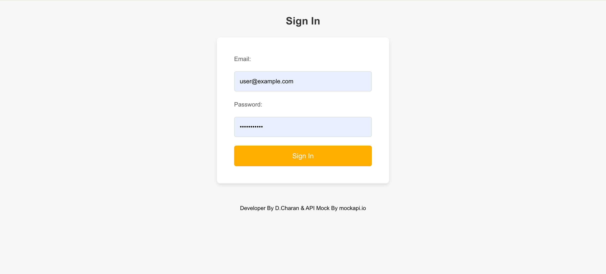
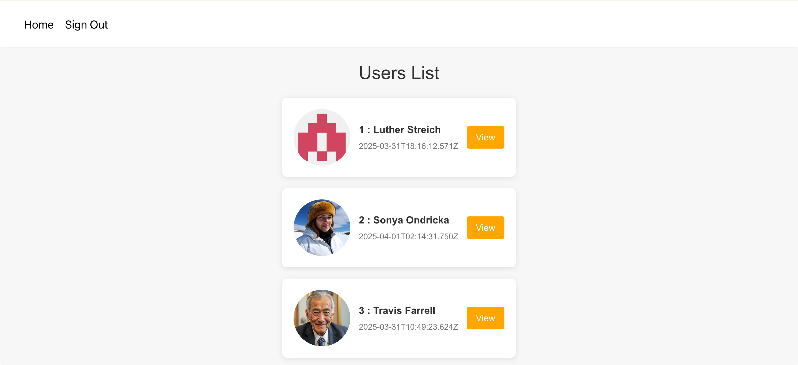
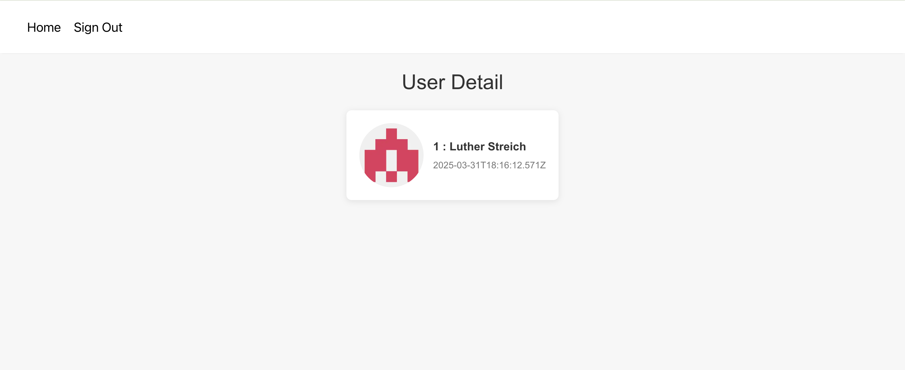

# Demo Next.js + Go API

โปรเจกต์ตัวอย่างสำหรับแสดงรายชื่อผู้ใช้และรายละเอียดผู้ใช้ โดยใช้ **Next.js 15 (App Router) + TypeScript** เป็น frontend/BFF และเรียกข้อมูลจาก Go API ภายนอก

- Frontend repository: `demo-next-ts`
- Backend API repository: [demo-go-api](https://github.com/charan-det-dev/demo-go-api)
- Styling: CSS Modules
- Runtime: Node.js 20+, Docker หรือ Docker Compose

## Features

- Sign-in page with demo credentials
- Protected routes: `/` และ `/users/*`
- Users list page
- User detail page: `/users/:id`
- Next.js Route Handlers สำหรับ proxy requests ไปยัง Go API
- Cookie-based authentication สำหรับ demo flow
- Production-ready standalone Docker image

## Screenshots

### Sign in



### Users list



### User detail



## Project Flow

```text
Browser
  |
  |  GET /users หรือ GET /users/:id
  v
Next.js App Router
  |
  |  GET /api/users หรือ GET /api/users/:id
  v
Go API (demo-go-api)
  |
  v
User data
```

หน้าเว็บจะไม่เรียก Go API โดยตรงจาก browser แต่จะเรียกผ่าน Next.js Route Handler เพื่อรวม logic ของ API และจัดการ cookie ในฝั่ง server

## Backend API

Backend source code อยู่ที่:

[https://github.com/charan-det-dev/demo-go-api](https://github.com/charan-det-dev/demo-go-api)

โปรเจกต์ Next.js เรียก API หลักดังนี้:

| Next.js endpoint | Go API endpoint | Method | Description |
| --- | --- | --- | --- |
| `/api/users` | `/users` | `GET` | ดึง users ทั้งหมด |
| `/api/users/:id` | `/users/:id` | `GET` | ดึง user ตาม id |

ตัวอย่าง request:

```bash
curl http://localhost:3000/api/users
curl http://localhost:3000/api/users/20
```

ค่า base URL ของ Go API อ่านจาก environment variable:

```text
USERS_API_BASE_URL=http://localhost:8080
```

ถ้าไม่ได้กำหนด variable นี้ Next.js จะใช้ `http://localhost:8080` เป็นค่า default

## Authentication Flow

1. User submits email และ password ที่ `/sign-in`
2. Frontend ส่ง `POST /api/sing-in`
3. Route Handler ตรวจสอบ demo credentials
4. ถ้าถูกต้อง ระบบจะสร้าง `HttpOnly` cookie ชื่อ `token`
5. Middleware ตรวจ cookie ก่อนอนุญาตให้เข้า `/` และ `/users/*`
6. ถ้าไม่มี token จะ redirect กลับไปที่ `/sign-in`

Demo credentials:

```text
Email:    user@example.com
Password: password123
```

> Credentials และ token ในโปรเจกต์นี้มีไว้สำหรับ demo เท่านั้น ไม่ควรใช้ใน production ควรย้ายไปใช้ database และ secret manager

## Requirements

- Node.js `>= 20`
- npm
- Go API จาก [demo-go-api](https://github.com/charan-det-dev/demo-go-api) running on port `8080`

## Run Locally

ติดตั้ง dependencies:

```bash
npm install
```

เริ่ม development server:

```bash
npm run dev
```

เปิดเว็บที่ [http://localhost:3000](http://localhost:3000)

ถ้า Go API รันที่ URL อื่น ให้กำหนดค่าเอง:

```bash
USERS_API_BASE_URL=http://localhost:8080 npm run dev
```

## Docker

สร้าง production image:

```bash
docker build -t demo-next-ts:local .
```

รัน container:

```bash
docker run --rm -p 3000:3000 \
  -e USERS_API_BASE_URL=http://host.docker.internal:8080 \
  -e COOKIE_SECURE=false \
  demo-next-ts:local
```

หมายเหตุ: ภายใน container ค่า `localhost` หมายถึง container ของ Next.js เอง หาก Go API รันบนเครื่อง host ให้ใช้ `host.docker.internal`

## Docker Compose

เริ่ม service:

```bash
docker compose up -d --build
```

เปิดเว็บที่ [http://localhost:3000](http://localhost:3000)

ดู logs:

```bash
docker compose logs -f web
```

หยุด service:

```bash
docker compose down
```

ค่า default ใน `docker-compose.yml` คือ:

```yaml
USERS_API_BASE_URL: http://host.docker.internal:8080
COOKIE_SECURE: false
```

ถ้า deploy หลัง HTTPS reverse proxy ให้ตั้งค่า:

```bash
COOKIE_SECURE=true docker compose up -d --build
```

## Useful Commands

```bash
npm run dev       # Start development server
npm run build     # Create production build
npm run start     # Start production server
docker compose up -d --build
```

## Main Project Structure

```text
app/
├── api/
│   ├── check-authen/       # Check token cookie
│   ├── sing-in/            # Demo sign-in endpoint
│   └── users/              # Proxy endpoints to Go API
├── sign-in/                # Sign-in page and CSS Module
├── users/                  # Users list page
│   └── [id]/               # User detail page
├── layout.tsx              # Root layout and global CSS entry
└── page.tsx                # Home page
middleware.tsx              # Route protection
Dockerfile                  # Multi-stage production image
docker-compose.yml          # Container orchestration
```

## Notes

- `next.config.ts` uses `output: "standalone"` for a smaller production image.
- Page styles use CSS Modules such as `page.module.css` and `sign-in.module.css`.
- In development, React Strict Mode may run effects more than once to detect unsafe side effects.
